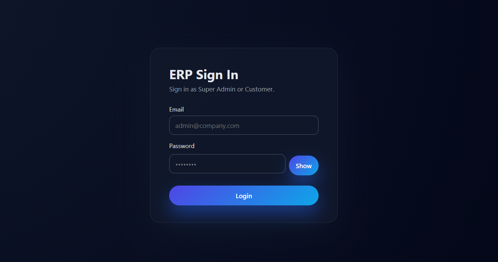
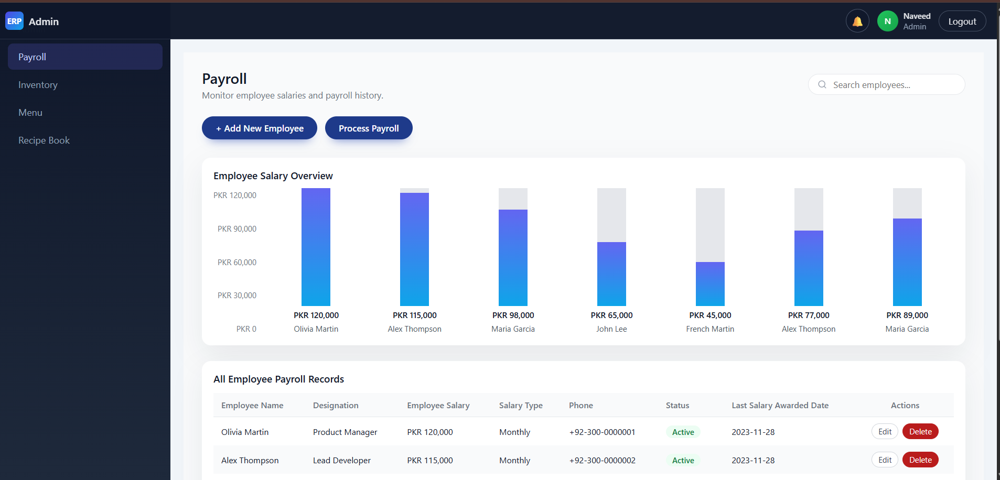
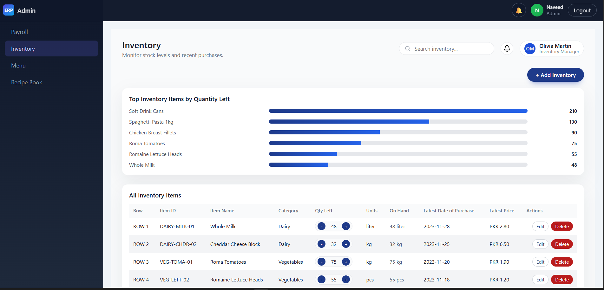

# Epsilon ERP – Complete Web‑Based ERP System

A full‑stack ERP for Epsilon Systems to manage customers, orders, payroll, inventory, and menu recipes.  
Frontend is a React single‑page app, backend is PHP + MySQL, deployed on Apache under `/erp`.
---
## Features
### Admin Features
- Performance dashboard (overall KPIs)
- Manage customers and client accounts
- Create, edit and delete orders
- Payroll management (employees, salaries, slips)
- Inventory management (items, stock levels, alerts)
- Menu recipe book management (recipes, ingredients, costing)
- Manage ERP users and roles
### User Features
- Secure login to ERP portal
- View own customers / assigned orders (role-based)
- View personal payroll information (for employee role)
- View inventory and interact according to role (store/warehouse)
- View menu recipes (production/kitchen role)
- Track order status and history
- Personal dashboard with quick stats
### Authentication
- Email/password-based login
- PHP session-based authentication
- Protected API endpoints and frontend routes
- Role-based access control (Admin, Accounts/Payroll, Inventory, Production, etc.)
---
## Tech Stack
- Backend: PHP (vanilla), Apache, MySQL (PDO)
- Frontend: React (Vite build), HTML5, CSS3, JavaScript
- API Style: REST-like JSON API under `/erp/api/*`
- Styling: Custom CSS with blue and white dashboard theme
---
## Installation
1. Clone the repository:
   ```bash
   git clone https://github.com/<your-username>/<your-erp-repo>.git
   cd <your-erp-repo>
Create MySQL database:

Create a database, e.g. epsilon_erp.
Import the provided SQL file (users, customers, orders, payroll, inventory, recipes, etc.).
Configure database connection:

Edit erp/config.php:

$DB_HOST = '127.0.0.1';
$DB_NAME = 'epsilon_erp';
$DB_USER = 'root';
$DB_PASS = '';
Run locally (PHP built‑in server):

cd erp
php -S localhost:8000
ERP portal: http://localhost:8000
API base: http://localhost:8000/api/...
Running in Production (Apache / Hostinger)
Upload the erp/ folder to public_html/erp on your hosting.
Ensure the folder name is erp (lowercase) and matches all paths.
Keep .htaccess files in:
erp/.htaccess – routes all /erp/* SPA paths to index.html
erp/api/.htaccess – routes /erp/api/* to api/index.php
Access the live ERP at: https://your-domain.com/erp/
Default Credentials (Example)
Change or remove these before making the repository public.

Admin:

Email: admin@epsilon-erp.com
Password: admin123
Normal user:

Created by Admin (or inserted in DB), then logs in from the login page.
Project Structure
epsilon-erp/
├── erp/
│   ├── index.html              # React build entry (root div)
│   ├── config.php              # Database configuration
│   ├── src/
│   │   ├── Database.php        # PDO connection helper
│   │   ├── AuthController.php  # Login, logout, session handling
│   │   ├── CustomerController.php   # Customers + orders
│   │   ├── PayrollController.php    # Payroll logic (if split)
│   │   ├── InventoryController.php  # Inventory logic
│   │   ├── RecipeController.php     # Menu recipe book logic
│   │   └── helpers.php         # Common utilities, JSON responses, validation
│   ├── api/
│   │   ├── index.php           # Central API router
│   │   └── .htaccess           # Rewrite /erp/api/* → index.php
│   ├── assets/
│   │   ├── index-*.js          # Bundled React JS
│   │   └── index-*.css         # Bundled CSS
│   ├── .htaccess               # SPA routing for /erp/*
│   └── screenshots/            # Screenshots used in README
└── (optional root marketing site files)
API Endpoints (High-Level)
All endpoints are under /erp/api.

Authentication
POST /erp/api/auth/login – User login
POST /erp/api/auth/logout – Logout
GET /erp/api/auth/me – Get current logged-in user
Customers
GET /erp/api/customers – Get all customers
GET /erp/api/customers/:id – Get single customer
POST /erp/api/customers – Create customer
PUT /erp/api/customers/:id – Update customer
DELETE /erp/api/customers/:id – Delete customer
Orders
GET /erp/api/orders – Get all orders
GET /erp/api/orders/:id – Get single order
POST /erp/api/orders – Create order
PUT /erp/api/orders/:id – Update order
DELETE /erp/api/orders/:id – Delete order
Payroll
GET /erp/api/payroll – List payroll records
GET /erp/api/payroll/:id – Single payroll record
POST /erp/api/payroll – Create payroll entry
PUT /erp/api/payroll/:id – Update payroll entry
Inventory
GET /erp/api/inventory – List inventory items
POST /erp/api/inventory – Add item
PUT /erp/api/inventory/:id – Update item
DELETE /erp/api/inventory/:id – Delete item
Recipes
GET /erp/api/recipes – List recipes
POST /erp/api/recipes – Create recipe
PUT /erp/api/recipes/:id – Update recipe
DELETE /erp/api/recipes/:id – Delete recipe
Dashboard
GET /erp/api/dashboard/admin – Admin dashboard stats
GET /erp/api/dashboard/user – User dashboard stats
Database (Conceptual)
Users
id (PK)
name
email (unique)
password (hashed)
role (admin, accounts, inventory, production, user, …)
created_at, updated_at
Customers
id (PK)
name
company
email
phone
address
created_by (FK → users.id)
created_at, updated_at
Orders
id (PK)
customer_id (FK → customers.id)
created_by (FK → users.id)
status (pending, in_progress, completed, cancelled)
total_amount (optional)
created_at, updated_at
Payroll
id (PK)
employee_id (FK → users.id)
basic_salary
allowances
deductions
net_salary
month
year
status (generated, paid, etc.)
created_at, updated_at
Inventory
id (PK)
item_name
category
unit (kg, piece, litre, etc.)
stock_quantity
min_stock_level
unit_cost
created_at, updated_at
Recipes
id (PK)
recipe_name
category
description
created_at, updated_at
(Optionally, a recipe_ingredients table to link recipes ↔ inventory items with quantities.)

Screenshots
Store all images in a screenshots/ folder and reference them here:






Theme
Primary Blue: #2563eb
Dark Blue: #1e40af
Background: white / #f5f7fa
Clean, card-based layout focused on dashboards and readability.
